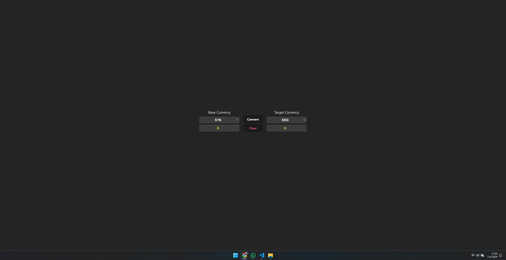
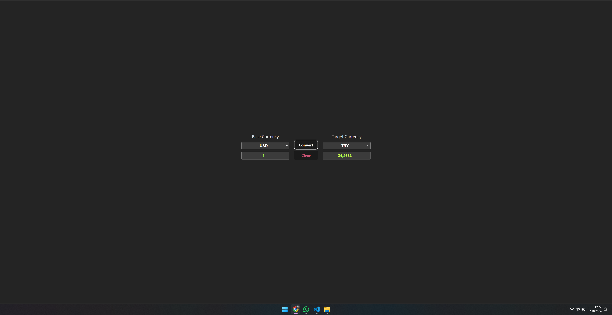
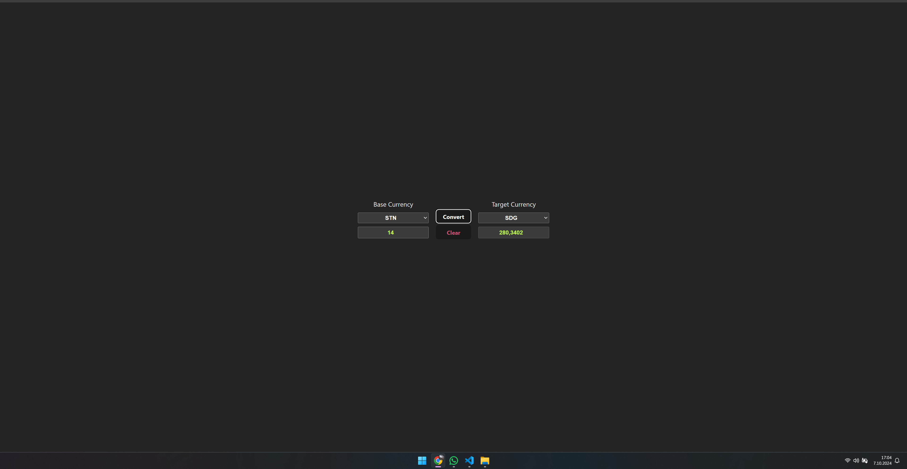

# React + Vite

This simple react app converts base currency to target currency on demand.

- API KEY should be provided in order to use.
- Sign up and get an monthly 1500 request api at <https://www.exchangerate-api.com>

---ScreenShots---

  |    |
  |

Currently, two official plugins are available:

- [@vitejs/plugin-react](https://github.com/vitejs/vite-plugin-react/blob/main/packages/plugin-react/README.md) uses [Babel](https://babeljs.io/) for Fast Refresh
- [@vitejs/plugin-react-swc](https://github.com/vitejs/vite-plugin-react-swc) uses [SWC](https://swc.rs/) for Fast Refresh
